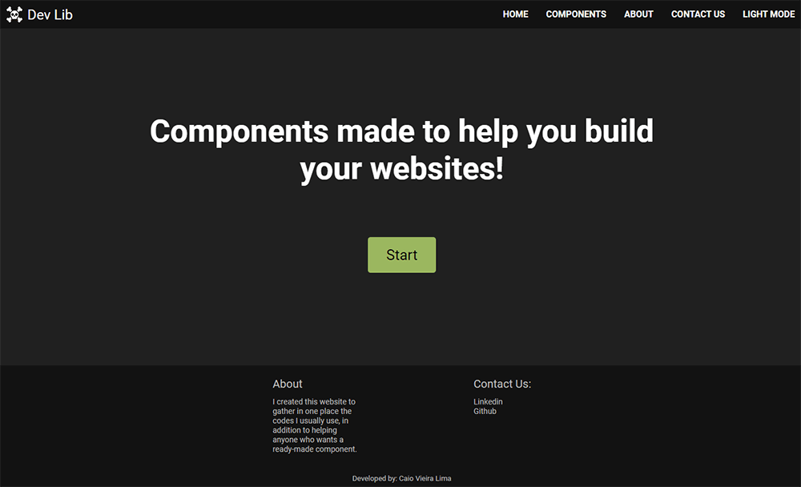
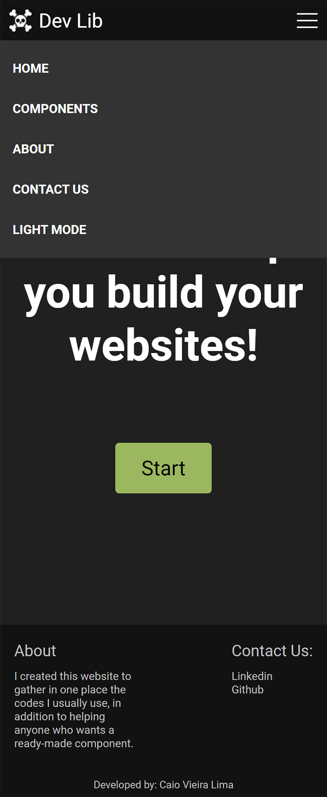

# Dev Lib

I've created this website to gather the codes/components I usually use and help who want some already made codes/components.

 

## Table of contents

- [About](#about)
    - [How it works](#how-it-works)
    - [What users can do](#what-users-can-do)

- [Screenshots](#screenshots)
    - [Desktop](#desktop)
        - [Light Mode](#dLightMode)
        - [Dark Mode](#dDarkMode)

    - [Mobile](#mobile)
        - [Light Mode](#mLightMode)
        - [Dark Mode](#mDarkMode)

- [Used Libs](#used-libs)

- [Author](#author)

 

***
 

## About

### How it works

You copy the reset css and download the icons, then click on the desired component and copy the provided codes.

 

### What users can do

-> Copy the providade codes. 
-> Change from light to dark mode, and vice versa.

 
 

## Screenshots

### Desktop

- #### 
Light Mode

 

- #### 
Dark Mode

 

### Mobile

- #### 
Light Mode

 

- #### 
Dark Mode

 
 

## Used Libs 

[Chackra Ui](https://chakra-ui.com/) 
[Styled Components](https://styled-components.com/)

 
 

## Link

<a href = "https://devlib.vercel.app/" target="_blank">Link</a>

 
 

## Author

- [Caio Vieira de Castro Lima](https://www.linkedin.com/in/caiovieiralima/)